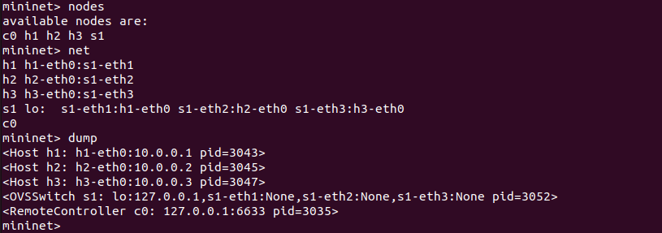
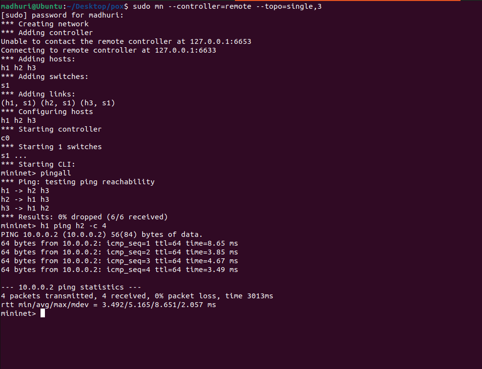

# SDN ARP Handling in Mininet using POX Controller

## Problem Statement
Implement ARP request and reply handling using an SDN (Software Defined Networking) controller.
The POX controller intercepts ARP packets, logs ARP requests, and floods them so destination hosts can respond.
This demonstrates controller-switch interaction and flow rule design using OpenFlow.

---

## Prerequisites
- Ubuntu 20.04 / 22.04
- Python 3.10
- Mininet installed
- POX controller

---

## Setup & Execution

### Step 1 — Install Mininet
```bash
sudo apt update
sudo apt install mininet -y
```

### Step 2 — Clone POX Controller
```bash
cd ~/Desktop
git clone https://github.com/noxrepo/pox.git
```

### Step 3 — Copy Controller Script
```bash
cp arp_controller.py ~/Desktop/pox/
```

### Step 4 — Run POX Controller (Terminal 1)
```bash
cd ~/Desktop/pox
python3 pox.py arp_controller
```

Expected output:
POX 0.7.0 (gar) / Copyright 2011-2020 James McCauley, et al.
INFO:arp_controller:Simple ARP + Flood Controller Started
INFO:core:POX 0.7.0 (gar) is up.
INFO:openflow.of_01:[00-00-00-00-00-01 2] connected

### Step 5 — Run Mininet (Terminal 2)
```bash
sudo mn --controller=remote --topo=single,3
```

Expected output:
*** Creating network
*** Adding controller
*** Adding hosts: h1 h2 h3
*** Adding switches: s1
*** Adding links: (h1, s1) (h2, s1) (h3, s1)
*** Configuring hosts
*** Starting controller c0
*** Starting 1 switches s1
*** Starting CLI
mininet>

---

## Mininet Output & Verification

### Test 1 — View Topology

**nodes**
mininet> nodes
available nodes are:
c0 h1 h2 h3 s1

**net**
mininet> net
h1 h1-eth0:s1-eth1
h2 h2-eth0:s1-eth2
h3 h3-eth0:s1-eth3
s1 lo: s1-eth1:h1-eth0 s1-eth2:h2-eth0 s1-eth3:h3-eth0
c0

**dump**
mininet> dump
<Host h1: h1-eth0:10.0.0.1 pid=3043>
<Host h2: h2-eth0:10.0.0.2 pid=3045>
<Host h3: h3-eth0:10.0.0.3 pid=3047>
<OVSSwitch s1: lo:127.0.0.1,s1-eth1:None,s1-eth2:None,s1-eth3:None pid=3052>
<RemoteController c0: 127.0.0.1:6633 pid=3035>
3 hosts (h1, h2, h3) connected to 1 switch (s1), managed by remote POX controller at 127.0.0.1:6633.


---

### Test 2 — Full Connectivity Test (pingall)
mininet> pingall
*** Ping: testing ping reachability
h1 -> h2 h3
h2 -> h1 h3
h3 -> h1 h2
*** Results: 0% dropped (6/6 received)
All 6 packets received with 0% packet loss — ARP handling by POX controller is working correctly.

---

### Test 3 — Individual Host Ping
mininet> h1 ping h2 -c 4
PING 10.0.0.2 (10.0.0.2) 56(84) bytes of data.
64 bytes from 10.0.0.2: icmp_seq=1 ttl=64 time=8.65 ms
64 bytes from 10.0.0.2: icmp_seq=2 ttl=64 time=3.85 ms
64 bytes from 10.0.0.2: icmp_seq=3 ttl=64 time=4.67 ms
64 bytes from 10.0.0.2: icmp_seq=4 ttl=64 time=3.49 ms
--- 10.0.0.2 ping statistics ---
4 packets transmitted, 4 received, 0% packet loss, time 3013ms
rtt min/avg/max/mdev = 3.492/5.165/8.651/2.057 ms
h1 successfully communicates with h2. ARP resolution handled by controller, 0% packet loss confirmed.

## Cleanup
```bash
mininet> exit
sudo mn -c
```

---

## References
- Mininet: http://mininet.org
- POX Controller: https://github.com/noxrepo/pox
- OpenFlow Specification: https://opennetworking.org/software-defined-standards/specifications/
---
